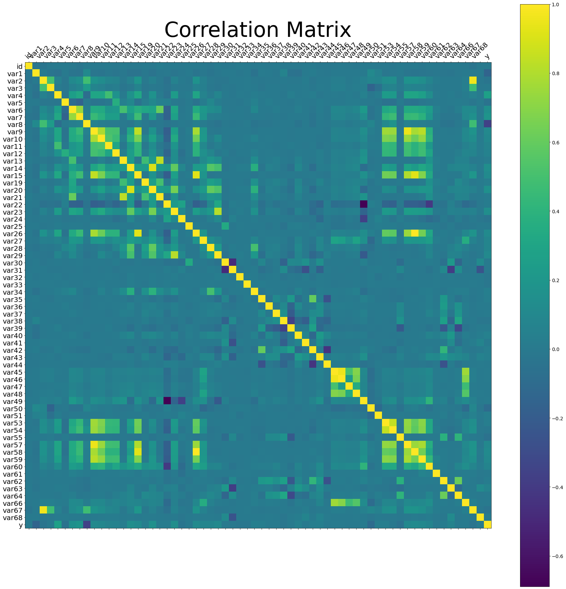

## 🔖 Sobre
O intuito desse trabalho é realizar a análise exploratória e cumprir o desafio da Porto Seguro Challange na Kaggle.[Porto Seguro Data Challange](https://www.kaggle.com/c/porto-seguro-data-challenge/).

### 🔨️ Descrição do desafio
Você provavelmente já recebeu uma ligação de telemarketing oferecendo um produto que você não precisa. Essa situação de estresse é minimizada quando você oferece um produto que o cliente realmente precisa.
Nessa competição você será desafiado a construir um modelo que prediz a probabilidade de aquisição de um produto.
Embora a Porto Seguro use Aprendizado de Máquina há mais de 20 anos, entendemos que objetivo desse desafio é:
- reconhecer os profissionais e estudantes da área;
- ampliar horizontes científicos com novas metodologias;
- dar visibilidade as melhores práticas na utilização de algoritmos já conhecidos.

### ✏️ Tarefas
- Manipulação de dados com Python
- Manipulação de dados com Pandas
- Visualização de dados
- Machine Learning

</br>

<p align="center"> 
  
</p>

</br>

## 🚀 Bibliotecas utilizadas

- [Plotly](https://plotly.com/)
- [Numpy](https://numpy.org/)
- [Matplotlib](https://matplotlib.org/)
- [Pandas](https://pandas.pydata.org/)
- [Seaborn](https://seaborn.pydata.org/)

</br>

## 🗂 Como baixar e iniciar o projeto

```bash
# Abra um terminal e copie este repositório com o comando
$ git clone https://github.com/cbvreis/-KAGGLE-porto-seguro-challange.git
# ou use a opção de download.

pip install -r requirements.txt

# Entrar no diretorio **/-KAGGLE-porto-seguro-challange**
$ cd -KAGGLE-porto-seguro-challange
```

Desenvolvido por [Cássio Reis](https://www.linkedin.com/in/cassioreisdevelop/) 🤓

